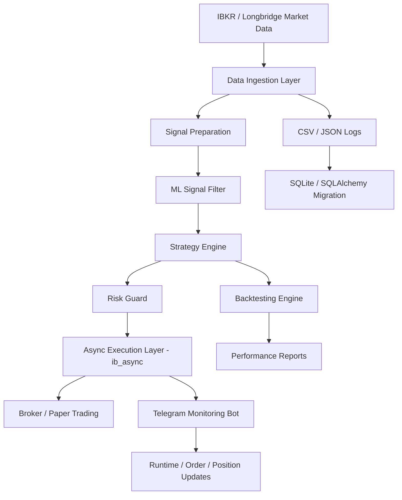

# Architecture

This document describes the high-level architecture of the AI-native quant trading system.

## Public vs private boundary

| Layer | Public repository | Private system |
| --- | --- | --- |
| Architecture docs | Included | Included |
| Safe toy demo | Included | Not required |
| Live IBKR connection | Excluded | Included |
| Telegram credentials | Excluded | Included |
| Proprietary strategy parameters | Excluded | Included |
| Account/position data | Excluded | Included |
| Tests and engineering notes | Summarized | Included |

## System diagram



## Modules observed in the private Git snapshot

The private project has a modular Python layout:

```text
src/
├── backtesting/
├── bots/
│   └── commands/
├── execution/
├── market_data/
├── ml/
├── notifications/
├── persistence/
├── reporting/
├── risk/
├── strategies/
└── tools/
```

## Data ingestion

Responsibilities:

- Fetch quotes and market snapshots
- Normalize raw market data
- Record price data for offline analysis
- Provide fallback historical price behavior when live data is unavailable

## ML signal layer

Responsibilities:

- Evaluate candidate trades using score thresholds
- Attach model score, allow/deny decision, and reason fields
- Support auditability for later review
- Avoid letting low-confidence signals reach execution

## Strategy engine

Responsibilities:

- Stock and BTC strategy logic
- Score-first entry gating
- Cooldown control
- Take-profit / stop-loss decision logic
- Compatibility with backtesting and paper-trading style execution

## Risk guard

Responsibilities:

- Prevent over-exposure
- Enforce per-order and portfolio limits
- Support daily loss kill-switch logic
- Keep execution separate from strategy desire

## Execution layer

The private system migrated from `ib_insync` to `ib_async`, which better fits async runtime and bot/monitoring workflows.

Responsibilities:

- Order placement and status handling
- Mock BTC execution helpers
- Fill display and order filtering
- Recovery from connection issues

## Monitoring and reporting

Responsibilities:

- Telegram command router
- `/status`, `/portfolio`, `/orders`, `/trades`, `/performance`, and related command groups
- Health check reporting
- Daily performance snapshots
- Notification noise reduction

## Persistence

Current/legacy state:

- CSV / JSON runtime logs
- Strategy state files
- Trade logs
- ML decision logs

Planned direction:

- SQLite database
- SQLAlchemy models
- migration scripts
- export tools for analysis
