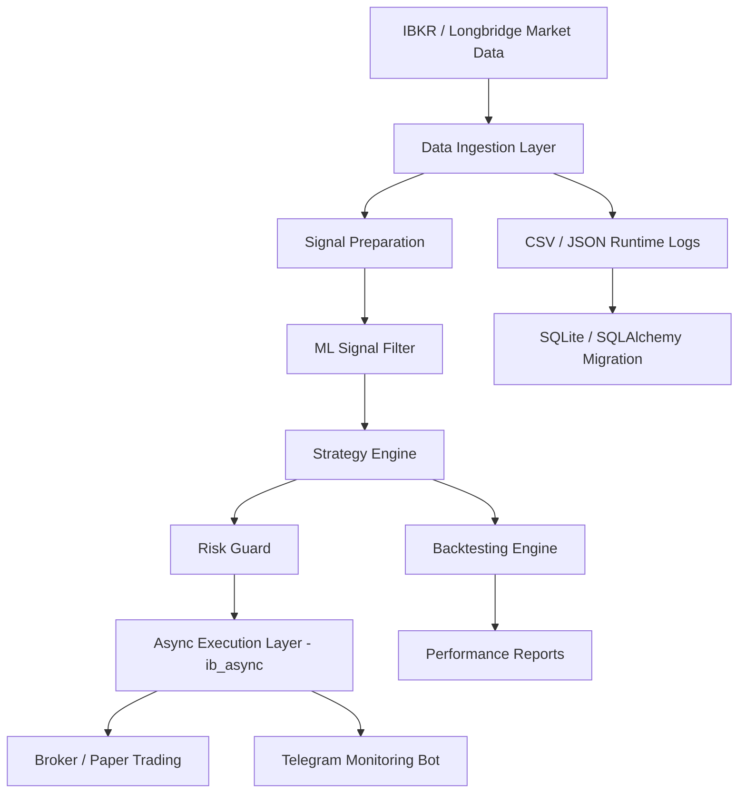

# AI-native Quant Trading System

> A public engineering case study and safe demo for a private AI-assisted Python quant trading system.

This repository documents the journey from manual IBKR limit-order trading to a modular, AI-assisted quantitative trading system. It does **not** publish live trading source code, brokerage credentials, account data, or proprietary strategy parameters. Instead, it presents the architecture, development timeline, refactoring process, and a small safe demo that can be run without broker access.

## Project status

- **Private production system:** IBKR paper-trading / BTC mock-trading system
- **Public repository purpose:** documentation, architecture, and safe demo
- **Current engineering focus:** CSV/JSON → SQLite/SQLAlchemy migration, modular refactor, test preservation
- **Risk posture:** no live credentials, no proprietary alpha logic, no financial advice

## Quick start

Run the safe demo locally. It uses toy CSV data and does **not** connect to IBKR, Longbridge, Telegram, or any live market service.

```bash
git clone https://github.com/Lucyprivate/quant-trading-system.git
cd quant-trading-system

python3 demo/toy_backtest.py --input demo/sample_market_data.csv
```

Expected output:

```text
Toy backtest summary
initial_cash: 10000.00
final_equity: ...
trades: ...
```

For more details, see [QUICK_START.md](QUICK_START.md).

## Why this project exists

The project began with a practical problem: manual limit-order trading on IBKR did not require constant screen watching, but the psychological pressure of pending orders still created late-night monitoring and decision fatigue.

I wanted to turn mathematical reasoning and market observation into an automated system. Since I did not start with a traditional programming background, AI coding agents became the bridge between trading logic and software engineering. The project grew from manual SSH copy/paste workflows into a Codex-assisted Python system running on an Azure Ubuntu VM.

## Private system capabilities

The private system includes:

- IBKR paper-trading workflow for U.S. equities
- BTC mock-trading module
- Telegram bot for runtime, order, and position updates
- Backtesting and performance reporting
- ML signal gating and score-first trade entry logic
- Risk controls, cooldowns, position caps, and runtime self-healing
- Ongoing data-layer migration from CSV/JSON to SQLite/SQLAlchemy

## Evidence from the private Git history

The uploaded private Git history shows:

- **60 Python source files** under `src/`
- **19 Python test/fixture files** under `tests/`
- **16 test modules** and approximately **128 test functions**
- **25 shell operation scripts** under `scripts/`
- Refactoring milestones including strategy module splits, BTC strategy split, and Telegram command split
- Migration from `ib_insync` to async-friendly `ib_async`

## Evolution highlights

| Date | Milestone |
| --- | --- |
| **2026-05-29** | Initial clean project snapshot with backtesting, market data ingestion, ML signals, risk management, BTC and stock strategies, Telegram bot, and automated tests. |
| **2026-05-29** | Added Python environment support and improved BTC trade output formatting. |
| **2026-05-29** | Reduced Telegram noise and enabled ML filters for both stock and BTC strategies. |
| **2026-05-30** | Added historical price fallback, simplified BTC status, fixed performance cron jobs, and improved recovery/health behavior. |
| **2026-05-31** | Added BTC runtime error recovery and Telegram IB connection self-healing. |
| **2026-06-01** | Implemented score-first entry logic for stocks and BTC; synchronized stock backtests; added audit fields. |
| **2026-06-02** | Replaced `ib_insync` with `ib_async`; improved BTC fill display; added BTC technical cache worker. |
| **2026-06-03** | Split strategy modules, BTC strategy modules, tests, and Telegram bot commands. |

## Architecture overview



## Documentation map

- [Quick Start](QUICK_START.md)
- [Architecture](ARCHITECTURE.md)
- [Changelog](CHANGELOG.md)
- [Roadmap](ROADMAP.md)
- [Security Policy](SECURITY.md)
- [Refactor case study](docs/refactor-case-study.md)
- [Safe demo backtest](docs/demo-safe-backtest.md)
- [Data pipeline and SQLite migration](docs/data-pipeline.md)
- [Redacted backtest result template](docs/backtest-results-redacted.md)
- [Glossary](docs/glossary.md)

## AI-assisted development

AI assistance was used as a development accelerator, not as a replacement for system design. My role focused on defining trading logic, reviewing architecture, enforcing test-driven refactoring, checking risks, and guiding the system from a monolithic prototype into modular components.

The workflow eventually evolved into a dual-agent model:

- **Advisor window:** proposes architecture, risks, and refactoring strategy without touching code.
- **Executor window:** performs approved changes, runs tests, and commits incremental progress.

## Disclaimer

This repository is for engineering and portfolio documentation only. Nothing here constitutes financial advice, investment advice, or a recommendation to trade any asset.
