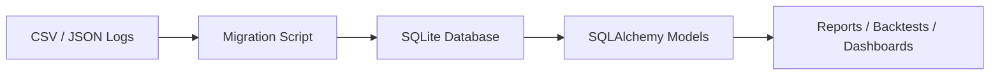

# Data Pipeline and SQLite Migration

## Current / legacy storage pattern

The private system has used CSV and JSON files for runtime logs and strategy state. This was useful during rapid AI-assisted prototyping because files are easy to inspect, append, and debug.

Observed storage responsibilities include:

- trade logs
- strategy state
- ML decision logs
- price/change logs
- health/performance outputs

## Why CSV/JSON becomes limiting

CSV/JSON is useful early, but it becomes fragile as the system grows:

- Hard to query across symbols and date ranges
- No schema enforcement
- Easy to create inconsistent columns
- Harder to audit historical decisions
- More difficult to join trades, prices, ML scores, and risk fields
- Increasing risk of duplicated parsing logic

## Target direction

The next public-facing architecture goal is to migrate runtime storage to SQLite with SQLAlchemy.

## Candidate tables

| Table | Purpose |
| --- | --- |
| `market_prices` | Recorded symbol prices, source, bid/ask, reference close |
| `trade_signals` | Strategy decisions before execution |
| `ml_decisions` | ML score, threshold, allow/deny reason |
| `orders` | Mock/live order intent and status |
| `fills` | Executed fills or simulated fills |
| `positions` | Position snapshots |
| `daily_performance` | Equity, cash, exposure, and performance records |
| `health_checks` | Runtime and broker connectivity status |

## Migration plan

1. Inventory all CSV/JSON read/write locations.
2. Define SQLAlchemy models for stable schemas.
3. Build one migration script per data category.
4. Replace one storage path at a time.
5. Keep old export-to-CSV helpers for inspection.
6. Add regression tests after each migration step.
7. Avoid changing function inputs/outputs during storage migration.

## Safety rules

- Never migrate and refactor strategy logic in the same commit.
- Keep old files until migration is validated.
- Use Git commits after every passing step.
- Add schema versioning before live use.
- Redact account data before using any logs in public documentation.
