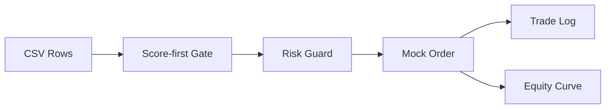

# Safe Demo Backtest

The public demo is designed to make the repository runnable without exposing private trading logic.

## Why a toy demo?

The private project contains broker integrations, Telegram monitoring, strategy logic, and runtime state. Publishing those details would create security and strategy-leak risks.

The demo therefore focuses on the **engineering pattern**:



## What it demonstrates

- How a market row is loaded
- How an ML-like score threshold can gate a trade
- How a simple risk budget limits order size
- How mock orders can produce trade/equity outputs
- How a repository can provide a runnable artifact without exposing real strategy logic

## What it intentionally omits

- IBKR connection
- Longbridge API calls
- Telegram bot credentials
- Live orders
- Real strategy parameters
- Real account balances or positions

## Run command

```bash
python3 demo/toy_backtest.py --input demo/sample_market_data.csv
```

## Optional outputs

```bash
python3 demo/toy_backtest.py   --input demo/sample_market_data.csv   --trades-out demo/trades_out.csv   --equity-out demo/equity_out.csv
```

## Next improvement

A future public demo could add:

- SQLite output
- parameter configuration
- chart generation
- sample unit tests
- GitHub Actions workflow validation
